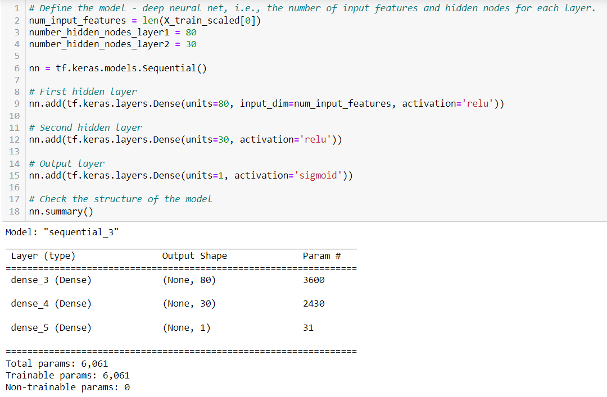

# Neural_Network_Charity_Analysis
Machine Learning and Neural Networks

## Overview
Alphabet Soup is a non-profit foundation dedicated to helping organizations that protect the environment, improve people's well-being and unify the world. The purpose of this analysis was to help Alphabet Soup create a binary classifier that is capable of predicting whether applicants will be successful if they are funded by their organization. Alphabet Soup has a dataset with 34,000 organizations that they have funded, which we will use to figure out our analysis. In order to use this dataset we:
    - Preprocessed the data for the neural network
    - Compiled, Trained, and Evaluated the model
    - Optimized the model

## Results

### Data Preprocessing
    - The variable that was considered the target for my model was the IS_SUCCESSFUL column. This is because it lets us know whether the organization Alphabet Soup helped was successful or not.
    
    - The variables that are considered to be the features of my model was the APPLICATION_TYPE, AFFILIATION, CLASSIFICATION, USE_CASE, ORGANIZATION, STATUS, INCOME_AMT, SPECIAL_CONSIDERATIONS, and ASK_AMT columns.
    
    - The variables that were neither a target nor feature were the EIN and NAME columns. These columns were non-beneficial and were removed from the input data.

### Compiling, Training, and Evaluating the Model
    - For my network neural model I had the following:
        - Hidden Layer 1: 80 neurons: Activation Function "ReLU"
        - Hidden Layer 2: 30 neurons: Activation Function "ReLU"
        - Output Layer: Activation Function "Sigmoid"

    
    Was the model able to achieve the target model performance?
        - The model was not able to achieve the target model performance for this attempt. The target was 75% and the accuracy score for my model was 69%. The model has a loss of 0.63.

    
    Steps Taken to try and increase model performance:

        Attempt 1:
        In order to try and increase the model performance, I dropped another column feature from the dataset because when a model does not meet your desired performance, it is a good ideas to check the input data and parameters. The more features in the input data, the model can become confused.

        The accuracy score actually increased from 69% to 71% with a loss of 0.70.

        Attempt 2:
        In order to try and increase the model performance, I used a different activation function from "Sigmoid" to "Tanh." Although the sigmoid function is the most-used, the tanh function can be used for classification, so I thought it would be a good one to try. It is slightly more complex than sigmoid because it expands the range between -1 and 1. This dataset is also kind of wide and tanh would be a good fit for a network model using a wide input dataset.

        The accuracy score decreased significantly from 71% to 49% with a loss of 3.64.

        Attempt 3:
        I added neurons to hidden layers and addtional hidden layers along with the new activation function, "Tanh". As you increase the number of neurons within the hidden layer, the classification accuracy could improve. Adding additional hidden layers will allow neurons to train on activated input values. Since this is true, a neural network with multiple layers could identify nonlinear characteristics of the input data without requiring more input data.

        The accuracy score continued to decrease from 49% to 46% with a loss of 2.62.

        Attempt 4:
        I changed the activation function back to "Sigmoid", but kept the addtional neurons and hidden layers. 

        The accuracy went back up a little from 46% to 53% with a loss of 0.70.

## Summary
Overall results of the deep learning model.

Once the model optimization was concluded, the model ended up with an accuracy score of 53%. The original neural network showed an accuracy score of 69%. but we got it to its' highest at 71% accuracy. However, this still did not meet the 75% goal. That being said, their was not much loss in accuracy. Since I added both neurons and hidden layers, it is likely that the model was overfitted. Another way that this model could be optimized is by removing more features that are not beneficial to the dataset. 
A different model that could solve this classification problem is the Random Forest Classifiers, because the random forest model has a faster performance than neural networks and the data has a likely chance of not being overfitted. Random Forest Classifiers would also be a good model because it has a large number of estimators and tree deoth that allows it to be efficient and accurate. With each split of the tree, the random forest model will consider a small subset of features rather than all of the features in the model.   